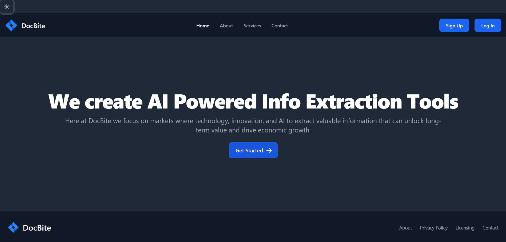
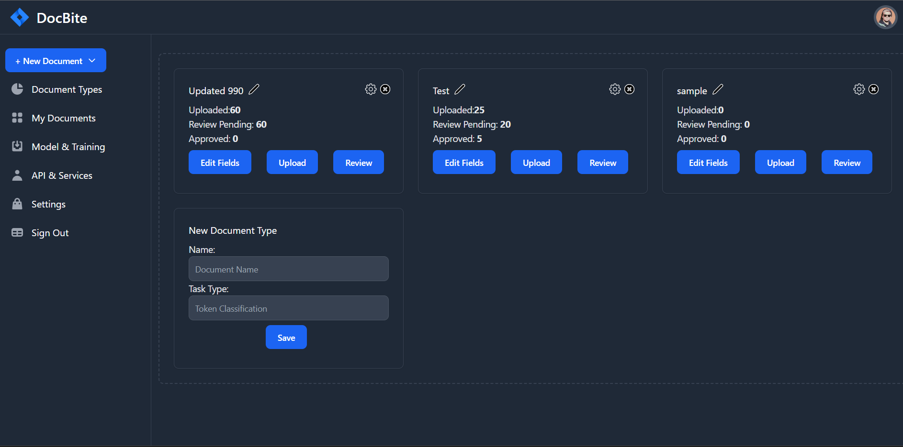
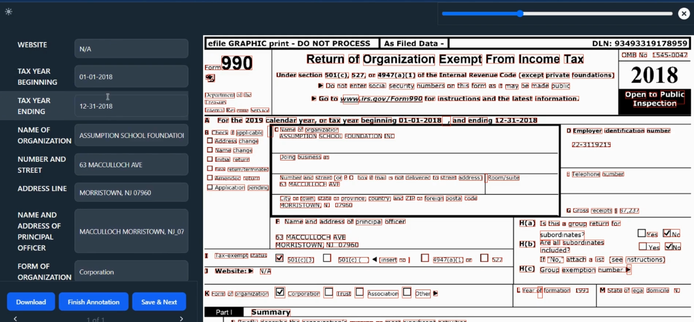
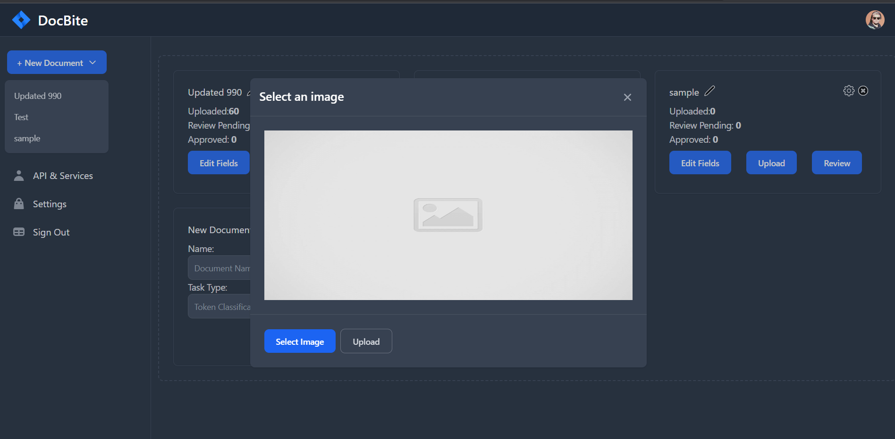
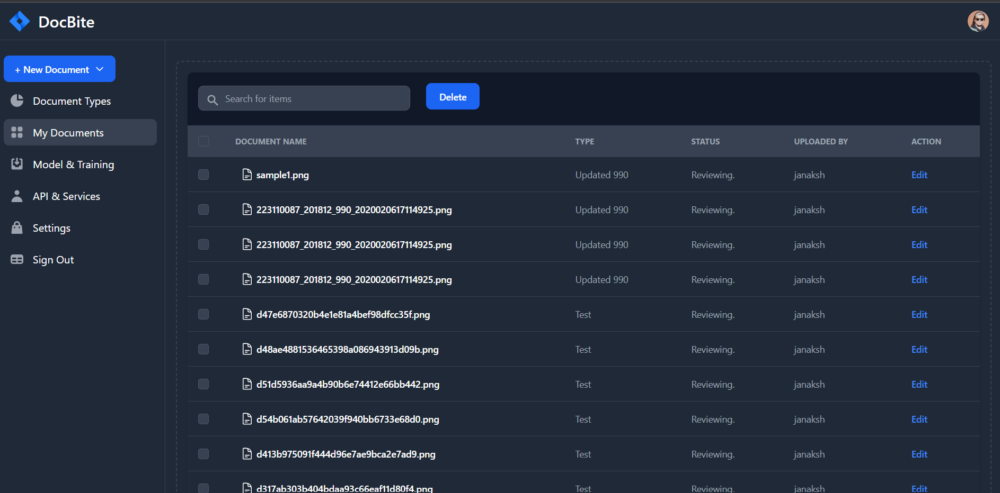

<!-- Improved compatibility of back to top link: See: https://github.com/othneildrew/Best-README-Template/pull/73 -->

<!-- 
*** Thanks for checking out the Best-README-Template. If you have a suggestion
*** that would make this better, please fork the repo and create a pull request
*** or simply open an issue with the tag "enhancement".
*** Don't forget to give the project a star!
*** Thanks again! Now go create something AMAZING! :D -->

<!-- PROJECT SHIELDS -->

<!-- *** I'm using markdown "reference style" links for readability.
*** Reference links are enclosed in brackets [ ] instead of parentheses ( ).
*** See the bottom of this document for the declaration of the reference variables
*** for contributors-url, forks-url, etc. This is an optional, concise syntax you may use.
*** https://www.markdownguide.org/basic-syntax/#reference-style-links -->

<!-- [![Contributors][contributors-shield]][contributors-url]
[![Forks][forks-shield]][forks-url]
[![Stargazers][stars-shield]][stars-url]
[![Issues][issues-shield]][issues-url]
[![MIT License][license-shield]][license-url]
[![LinkedIn][linkedin-shield]][linkedin-url] -->

<!-- PROJECT LOGO -->
 

  

  <h3 align="center">DocBite</h3>

  

    Introducing DocBite: Revolutionizing Information Extraction

Discover the cutting-edge interface, DocBite, meticulously crafted to streamline the intricate task of extracting organized data from a variety of document forms, ranging from Tax forms and citizenship applications to passports and more. DocBite stands as an innovative solution that empowers you to effortlessly automate the extraction of intricate content embedded within documents, whether they're in image or PDF format. By seamlessly transforming these documents into JSON or CSV formats, DocBite not only simplifies the process but also paves the way for seamless analysis and efficient processing of the extracted information. Experience the future of data extraction with DocBite!
     
    <a href="https://github.com/Aayushshah196/Docbite-Docs/"><strong>Explore the docs »</strong></a>
     
     
    <a href="#sample-demo">View Video Demo</a>
    ·
    <a href="https://github.com/Aayushshah196/Docbite-Docs/issues">Report Bug</a>
    ·
    <a href="https://github.com/Aayushshah196/Docbite-Docs/issues">Request Feature</a>
  

<!-- TABLE OF CONTENTS -->

  
Table of Contents

  <ol>
    <li>
      <a href="#about-the-project">About The Project</a>
      <ul>
        <li><a href="#built-with">Built With</a></li>
      </ul>
    </li>
    <li>
      <a href="#getting-started">Getting Started</a>
      <ul>
        <li><a href="#prerequisites">Prerequisites</a></li>
        <li><a href="#installation">Installation</a></li>
      </ul>
    </li>
    <li><a href="#usage">Usage</a></li>
    <li><a href="#roadmap">Roadmap</a></li>
    <li><a href="#contributing">Contributing</a></li>
    <li><a href="#license">License</a></li>
    <li><a href="#contact">Contact</a></li>
    <li><a href="#acknowledgments">Acknowledgments</a></li>
  </ol>

<!-- ABOUT THE PROJECT -->

## About The Project

Unveiling DocBite: Your Ultimate Data Liberation Engine

Unleash the potential of your documents like never before with DocBite – the ultimate information extraction powerhouse. Imagine effortlessly harnessing structured data from document forms, transforming the once daunting process into a symphony of efficiency. Say goodbye to the challenges faced by individuals and organizations when wrestling with intricate documents like Tax forms – where extracting specific details used to be a time-consuming ordeal plagued by errors.

DocBite was born out of the pressing need for a solution that not only reliably addresses data extraction but also revolutionizes it. We understand the value of your time and resources, and that's why DocBite is armed with state-of-the-art algorithms and techniques. It's not just about deciphering document forms; it's about extracting accurate, relevant information with a touch of innovation. Manual data entry? That's history.

Versatility is at the heart of DocBite. While its precision shines brightest with forms like the IRS 990, a staple in the nonprofit landscape, it effortlessly adapts to various document formats. This isn't just a tool – it's a companion that transcends industries and adapts to your unique use cases.

Step into a realm of simplicity and sophistication. DocBite's intuitive user interface transforms complexity into an elegant dance. Uploading document forms becomes second nature, and the extraction process? It's ignited with just a few clicks. But that's not all – you're in the driver's seat. Whether it's the seamless JSON or the versatile CSV format, the extracted data fits seamlessly into your existing systems or invites exploration with your favorite analysis tools and platforms.

Ready to amplify your workflow? DocBite doesn't just integrate – it elevates. With the DocBite API, you can seamlessly blend its prowess into your codebase, unlocking a world of streamlined efficiency that's tailored to your needs.

Experience the future of data liberation with DocBite – where innovation meets elegance, and complexity bows to your command. Let's revolutionize the way you handle data, one document at a time.

### Built With

- [![React][React.js]][React-url]
- [![TailWind][TailWind.com]][TailWind-url]
- [![FastAPI][FastAPI.com]][FastAPI-url]
- [![MongoDB][MongoDB]][MongoDB-url]

<!-- GETTING STARTED -->

## Getting Started

In order to get started With the project, you can follow below steps

### Installation

For detailed installation instructions, please refer to the [Installation Guide](docs/InstallationGuide.md).

<!-- KEY HIGHLIGHTS -->

## Key Highlights

Discover the exceptional features that set DocBite apart:

- **Seamless Document Imports:** Effortlessly import documents through the online interface, supporting various formats like PNG, JPEG, and PDF.

- **Customizable Annotation Tool:** Annotate documents with precision according to your specific needs using the built-in annotation tool.

- **Industry-Standard Data Formats:** DocBite ensures data is stored in industry-standard formats, maintaining compatibility and ease of use.

- **Real-Time Monitoring and Analytics:** Fine-tune performance with real-time monitoring and interactive analytics visualizations.

- **Machine Learning Model Retraining:** Retrain machine learning models with your unique datasets to enhance extraction precision.

- **Storage Integration:** Seamlessly integrate with storage accounts for content storage and distribution.

- **Programmatic Operation:** Access DocBite's functionality through RESTful APIs, directly integrating with your systems.

- **Flexible Data Export:** Export your data in multiple formats, including JSON and CSV, for your preferred analysis tools.

<!-- USAGE EXAMPLES --> 

## Usage
Experience DocBite's user-friendly interface that simplifies structured data extraction from document forms with high accuracy.

_For more examples, please refer to the [Documentation](https://example.com)_

### ScreenShots

**Homepage**  

**Dashboard** 

**Annotation Page** 

**Document Upload**  

**Model and Training** 

**Documents**

### Sample Demo
https://github.com/Aayushshah196/Docbite-Docs/raw/main/Screenshots/Demo.mp4
<video width="560" height="315" controls>
  <source src="https://github.com/Aayushshah196/Docbite-Docs/raw/main/Screenshots/Demo.mp4" type="video/mp4">
  Your browser does not support the video tag.
</video>

<!-- CONTRIBUTING -->

## Contributing

Thank you for your interest in contributing to the DocBite project. While contributions are currently closed, we appreciate your support. Stay updated for future opportunities as we may open up contributions to the community.

<!-- 1. Fork the Project
2. Create your Feature Branch (`git checkout -b feature/AmazingFeature`)
3. Commit your Changes (`git commit -m 'Add some AmazingFeature'`)
4. Push to the Branch (`git push origin feature/AmazingFeature`)
5. Open a Pull Request -->

<!-- LICENSE -->

## License

Distributed under the MIT License. See `LICENSE.txt` for more information.

<!-- CONTACT -->

## Contact

Connect with our team members:

|  |  |  |  |
| :-: | :-: | :-: | :-: |
| [Aayush Shah Kanu](https://www.linkedin.com/in/aayush-shah-kanu) |[Adithya Pokharel](https://www.linkedin.com/in/adi13579/) | [Bishal Bashyal](https://www.linkedin.com/in/bishal-bashyal-80a261184/) | [Janak Sharma](https://www.linkedin.com/in/janaksharma/) |

(<a href="#readme-top">back to top</a>)

<!-- ACKNOWLEDGMENTS -->
<!--
## Acknowledgments

<!-- MARKDOWN LINKS & IMAGES -->
<!-- https://www.markdownguide.org/basic-syntax/#reference-style-links -->

[contributors-shield]: https://img.shields.io/github/contributors/othneildrew/Best-README-Template.svg?style=for-the-badge
[contributors-url]: https://github.com/othneildrew/Best-README-Template/graphs/contributors
[forks-shield]: https://img.shields.io/github/forks/othneildrew/Best-README-Template.svg?style=for-the-badge
[forks-url]: https://github.com/othneildrew/Best-README-Template/network/members
[stars-shield]: https://img.shields.io/github/stars/othneildrew/Best-README-Template.svg?style=for-the-badge
[stars-url]: https://github.com/othneildrew/Best-README-Template/stargazers
[issues-shield]: https://img.shields.io/github/issues/othneildrew/Best-README-Template.svg?style=for-the-badge
[issues-url]: https://github.com/othneildrew/Best-README-Template/issues
[license-shield]: https://img.shields.io/github/license/othneildrew/Best-README-Template.svg?style=for-the-badge
[license-url]: https://github.com/othneildrew/Best-README-Template/blob/master/LICENSE.txt
[linkedin-shield]: https://img.shields.io/badge/-LinkedIn-black.svg?style=for-the-badge&logo=linkedin&colorB=555
[linkedin-url]: https://linkedin.com/in/othneildrew
[product-screenshot]: images/screenshot.png
[Next.js]: https://img.shields.io/badge/next.js-000000?style=for-the-badge&logo=nextdotjs&logoColor=white
[Next-url]: https://nextjs.org/
[React.js]: https://img.shields.io/badge/React-20232A?style=for-the-badge&logo=react&logoColor=61DAFB
[React-url]: https://reactjs.org/
[FastAPI.com]: https://img.shields.io/badge/FastAPI-005571?style=for-the-badge&logo=fastapi
[FastAPI-URL]: https://fastapi.tiangolo.com/lo/
[TailWind.com]: https://img.shields.io/badge/tailwindcss-%2338B2AC.svg?style=for-the-badge&logo=tailwind-css&logoColor=white
[TailWind-url]: https://tailwindcss.com/
[MongoDB]: https://img.shields.io/badge/MongoDB-%234ea94b.svg?style=for-the-badge&logo=mongodb&logoColor=white
[MongoDB-url]: https://www.mongodb.com/
